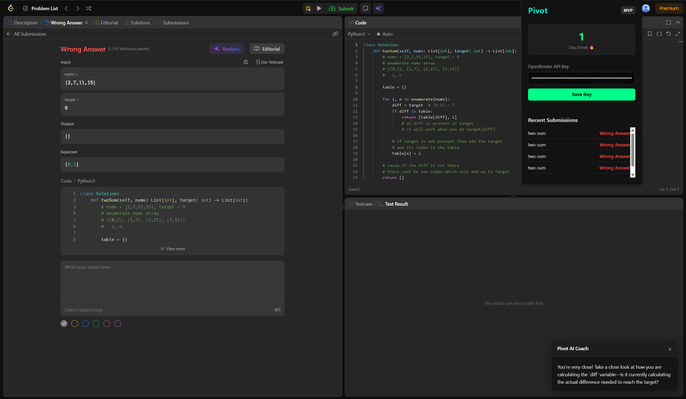

# Pivot — AI-Powered LeetCode Coach

A Chrome extension that sits on top of LeetCode and turns every submission into a learning moment. Pivot tracks your attempts, detects when you're stuck, and gives you a targeted hint from an AI coach — without just handing you the answer.


*Real example: Pivot correctly diagnosed that `diff` was never being calculated as `target - n`, catching a bug that caused every test case to fail.*

## The Problem

Grinding LeetCode in isolation is inefficient. You either:
- Stare at a wrong answer with no idea what's actually broken, or
- Immediately jump to the editorial/solution and learn nothing about debugging your own logic

Most tracking tools just log pass/fail. They don't help you find the bug in *your* code.

## What Pivot Does

- **Watches your submissions in real time** via a content script injected into the LeetCode problem page
- **Detects wrong answers** and captures your current code + the problem context
- **Sends it to an LLM** (via OpenRouter, so you can pick any model) for a targeted, specific hint — not a generic "check your logic" but an actual pointer to the broken line
- **Tracks submission history and a day streak** to keep grinding consistent, gamification-lite
- **BYOK (Bring Your Own Key)** — your OpenRouter API key is stored locally, so there's no backend cost to run and no server holding your data

## Architecture

```
LeetCode Problem Page
      │
      ▼
Content Script (injected)
  - Reads problem metadata (title, test cases, expected output)
  - Detects submission result via DOM/network observation
  - Extracts current editor code
      │
      ▼
Background Service Worker
  - Formats a prompt: problem + code + failing test case
  - Calls OpenRouter API with the user's stored key
      │
      ▼
Sidebar UI (injected)
  - Renders the AI Coach hint inline, next to the editor
  - Displays submission history + day streak from local storage
```

**Stack:** Chrome Extension (Manifest V3), vanilla JS/TS content + background scripts, `chrome.storage.local` for persistence, OpenRouter API for LLM inference.

## Key Design Decisions

- **Run vs Submit Intelligence.** Users can test their code with the "Run" button without burning an official profile attempt or breaking their streak. Pivot intelligently distinguishes between `/interpret_solution/` and `/submit/` to safeguard user stats while still providing AI hints on sample test cases.
- **No backend.** Storing the API key client-side and calling OpenRouter directly from the extension means zero hosting cost and zero server-side data retention — a deliberate tradeoff favoring privacy and simplicity over features like cross-device sync.
- **Hints, not solutions.** The coach is prompted to point at the specific broken logic rather than rewrite the function, to keep the tool aligned with learning rather than copy-pasting.
- **Manifest V3 service worker** instead of a persistent background page, in line with Chrome's current extension platform requirements.

## Status

Currently a working proof-of-concept: submission tracking, streak counter, Run/Submit differentiation, and AI-generated hints are all functional end-to-end on LeetCode's problem pages.

**Planned next:**
- Full solution walkthrough on request (currently hint-only)
- Multiple alternative approaches per problem
- Pattern-tagging across problems (e.g. "you consistently struggle with sliding window")

## Setup

1. Clone this repo
2. Load unpacked in `chrome://extensions` (Developer mode → Load unpacked)
3. Open a LeetCode problem, click the Pivot icon, paste in your OpenRouter API key
4. Submit code as normal — Pivot picks up wrong answers automatically

## Why "Pivot"

Named for the moment you get stuck and need to shift your approach — the extension's whole job is helping you find that pivot point faster than staring at a wall of red test cases would.